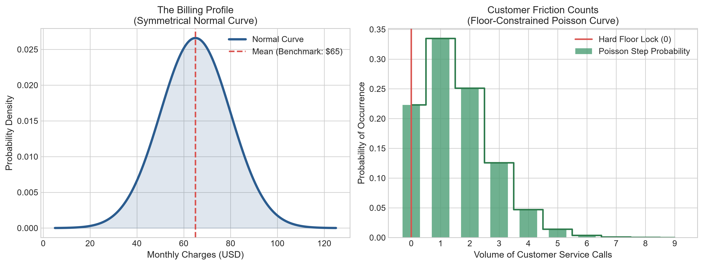
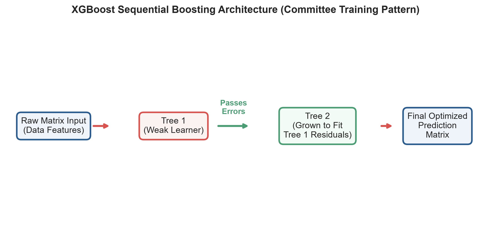
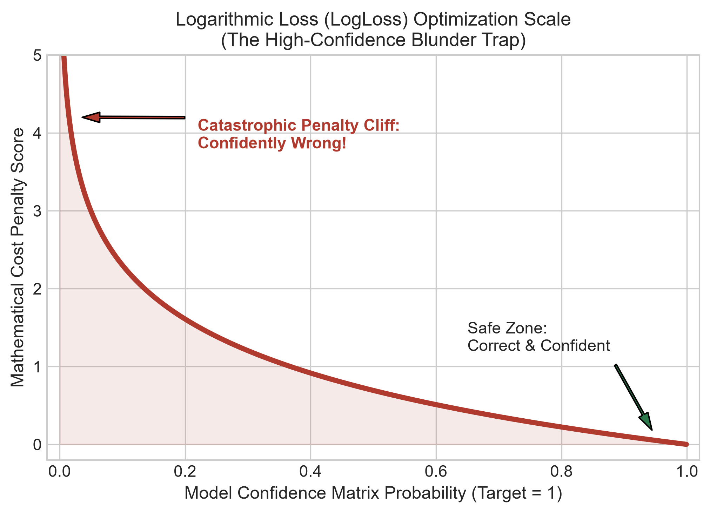

# 🧠 The Layman Guide to Advanced Sequential Ensembles & Class Imbalances

Welcome to the plain-English blueprint breaking down the advanced machine learning mathematics powering our Telecom Churn Prediction Engine.

---

## 📊 Concept 1: Symmetrical vs. Discontinuous Data Shapes (Normal vs. Poisson)

Real-world corporate data doesn't fit on a single chart shape. We modeled our telecom database using two distinct statistical signatures to simulate natural consumer behaviors:

### 1. The Billing Profile (Normal Distribution)
* **The Symmetrical Bell Curve:** Features like monthly charges map perfectly to a normal curve. Most subscribers sit in a thick peak right around a standard $65 baseline, with premium accounts and basic plans tapering off at matching rates on the left and right.

### 2. The Customer Friction Count (Poisson Distribution)
* **The Floor-Constrained Step Curve:** Support calls represent rare events tracked over time. Happy subscribers pool heavily against the absolute floor of 0 or 1 calls. Because negative support calls cannot physically exist, the data hits a hard wall at zero, leaving a long, stepped trail to the right representing highly frustrated users making 6 or 7 crisis calls.

---

## 🚨 Concept 2: The Accuracy Paradox & Class Imbalance

Imagine an airport metal detector that processes 10,000 travelers. If 9,995 are normal travelers and 5 are smugglers, an alarm system that stays completely silent for everyone hits a **99.95% accuracy rate**. However, it is a complete failure because it misses the critical targets it was built to find. 

When dealing with a 5% customer churn rate, standard accuracy is useless. We deploy **Stratified Splitting** to force our training and testing data splits to preserve exact 5% class proportions, ensuring our final exam is completely unbiased.

---

## 🧬 Concept 3: Synthetic Minority Over-sampling Technique (SMOTE)

To prevent our algorithms from being overwhelmed by the majority class, we deploy **SMOTE**. Instead of just copying the rare churn records, SMOTE behaves like a **Police Sketch Artist**. It maps the geometric distances between existing churn points and draws completely new, unique, highly realistic **synthetic subscriber profiles** in between them until our training data hits a perfect 50/50 equilibrium.

---

## 🌲 Concept 4: Sequential Ensemble Learning (XGBoost)

Instead of relying on a single decision tree, we build an **Ensemble Committee** of 150 weak trees. 

Unlike random tree models that vote simultaneously, **XGBoost works sequentially**. Tree 1 takes a shot at the data and makes mistakes (residuals). **Tree 2 is grown specifically to predict and fix the errors made by Tree 1**. This error-passing loop repeats 150 times, compounding collective accuracy into an ultra-precise early warning pipeline.

---

## 🧮 Concept 5: Probability Calibration (Logarithmic Loss)

Our ensemble does not output simple "Yes/No" guesses; it outputs fluid risk probabilities (e.g., 99.96% risk). We guide its training using **LogLoss**.

LogLoss acts as a confidence meter. If the model makes a mistake while being unsure, it receives a minor penalty. But if the model is highly confident and completely wrong (e.g., guessing a customer is 99% safe when they are actively canceling), the LogLoss curve accelerates into an **infinite mathematical penalty cliff**, forcing the system to eliminate high-confidence blunders.

